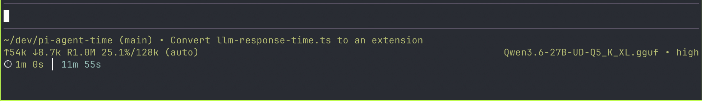

# pi-agent-time

A lightweight extension that tracks and displays LLM response times in the Pi status bar.

Keep an eye on how long your model takes to respond, both per turn and cumulatively across the session. The status bar shows the current turn time in green alongside the total session time in accent color, separated by a `┃` delimiter.

## What it shows

- **Current turn time** — how long the most recent agent turn took (formatted as ms, s, m, or h)
- **Cumulative session time** — total time spent on all agent turns in the current session

Both values reset when you start a new session.



## Usage

### Install

```bash
# From git (unpinned — updates with `pi update --extensions`)
pi install git:github.com/therynamo/pi-agent-time

# Pin to a tag
pi install git:github.com/therynamo/pi-agent-time@v0.1.0

# Local development
pi install /Users/theryngroetken/dev/pi-agent-time
```

### Behavior

The extension works automatically — no commands or shortcuts required. Times appear in the status bar footer as soon as the first agent turn completes, and update after each subsequent turn.
